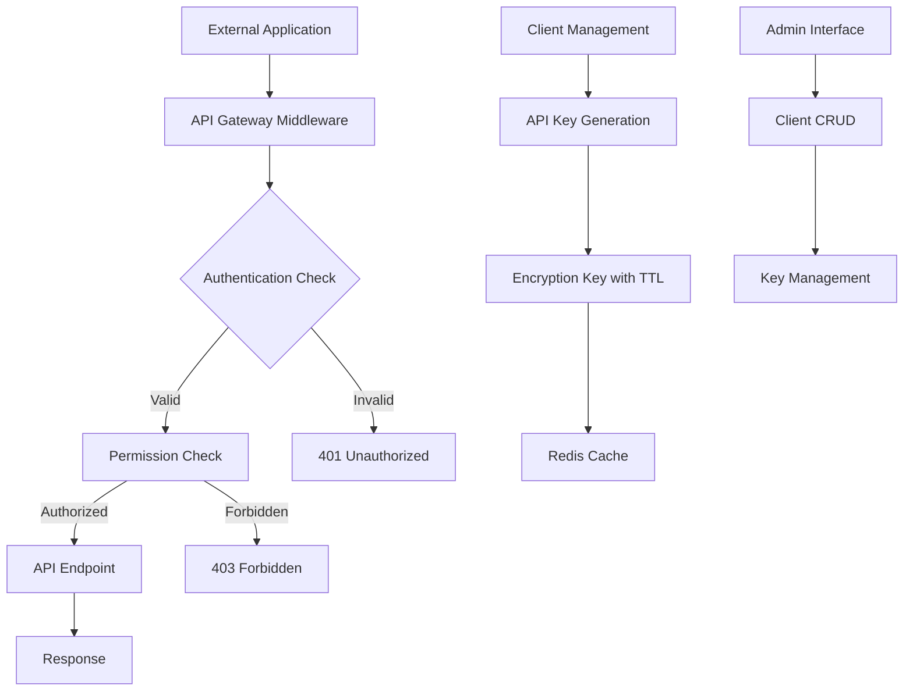

# API Authentication System Design

## Overview

This design document outlines the implementation of a comprehensive API authentication system for the Django blog application. The system will provide secure access to all non-admin endpoints through client ID management, time-based encryption key generation, and role-based authentication for CRUD operations.

The system extends the existing Django REST Framework setup to include:
- Client ID and API key management
- Time-based encryption key expiration
- Enhanced authentication middleware
- Comprehensive API endpoint exposure
- Rate limiting and security controls

## Architecture

### High-Level Architecture



### System Components

1. **Authentication Layer**
   - Custom authentication classes
   - Client ID validation
   - API key verification
   - Encryption key expiration handling

2. **Client Management System**
   - Client registration and management
   - API key generation and rotation
   - Permission assignment
   - Usage tracking

3. **API Gateway**
   - Request routing
   - Rate limiting
   - Response formatting
   - Error handling

4. **Security Layer**
   - Encryption key management
   - Time-based expiration
   - Request signing validation
   - IP whitelisting (optional)

## Components and Interfaces

### Models

#### APIClient Model
```python
class APIClient(models.Model):
    client_id = models.UUIDField(unique=True, default=uuid.uuid4)
    name = models.CharField(max_length=200)
    description = models.TextField(blank=True)
    is_active = models.BooleanField(default=True)
    created_by = models.ForeignKey(User, on_delete=models.CASCADE)
    created_at = models.DateTimeField(auto_now_add=True)
    updated_at = models.DateTimeField(auto_now=True)
    
    # Permission settings
    can_read_posts = models.BooleanField(default=True)
    can_write_posts = models.BooleanField(default=False)
    can_delete_posts = models.BooleanField(default=False)
    can_manage_categories = models.BooleanField(default=False)
    
    # Rate limiting
    requests_per_minute = models.IntegerField(default=60)
    requests_per_hour = models.IntegerField(default=1000)
    
    # IP restrictions
    allowed_ips = models.TextField(blank=True, help_text="Comma-separated IP addresses")
```

#### APIKey Model
```python
class APIKey(models.Model):
    client = models.ForeignKey(APIClient, on_delete=models.CASCADE, related_name='api_keys')
    key_hash = models.CharField(max_length=128, unique=True)
    encryption_key = models.CharField(max_length=256)
    expires_at = models.DateTimeField()
    is_active = models.BooleanField(default=True)
    created_at = models.DateTimeField(auto_now_add=True)
    last_used_at = models.DateTimeField(null=True, blank=True)
    usage_count = models.IntegerField(default=0)
```

#### APIUsageLog Model
```python
class APIUsageLog(models.Model):
    client = models.ForeignKey(APIClient, on_delete=models.CASCADE)
    endpoint = models.CharField(max_length=200)
    method = models.CharField(max_length=10)
    status_code = models.IntegerField()
    response_time = models.FloatField()
    timestamp = models.DateTimeField(auto_now_add=True)
    ip_address = models.GenericIPAddressField()
    user_agent = models.TextField(blank=True)
```

### Authentication Classes

#### ClientAPIKeyAuthentication
```python
class ClientAPIKeyAuthentication(BaseAuthentication):
    def authenticate(self, request):
        # Extract client_id and api_key from headers
        # Validate client exists and is active
        # Verify API key and check expiration
        # Return (client, api_key) tuple or None
```

#### EncryptionKeyAuthentication
```python
class EncryptionKeyAuthentication(BaseAuthentication):
    def authenticate(self, request):
        # Validate encryption key from request
        # Check key expiration
        # Verify request signature if required
        # Return authentication result
```

### API Endpoints Structure

#### Core API Endpoints
- `/api/v1/posts/` - Blog post CRUD operations
- `/api/v1/categories/` - Category management
- `/api/v1/users/` - User information (limited)
- `/api/v1/pages/` - Core page content
- `/api/v1/components/` - Component data
- `/api/v1/templates/` - Template information

#### Authentication Endpoints
- `/api/v1/auth/client/register/` - Client registration
- `/api/v1/auth/key/generate/` - Generate new API key
- `/api/v1/auth/key/refresh/` - Refresh encryption key
- `/api/v1/auth/validate/` - Validate current authentication

#### Management Endpoints
- `/api/v1/client/usage/` - Usage statistics
- `/api/v1/client/limits/` - Rate limit information
- `/api/v1/endpoints/` - Available endpoint discovery

### Middleware Components

#### APIAuthenticationMiddleware
```python
class APIAuthenticationMiddleware:
    def __init__(self, get_response):
        self.get_response = get_response
    
    def __call__(self, request):
        # Skip non-API requests
        # Perform authentication
        # Set client context
        # Log request
        response = self.get_response(request)
        # Log response
        return response
```

#### RateLimitMiddleware
```python
class RateLimitMiddleware:
    def __init__(self, get_response):
        self.get_response = get_response
        self.cache = caches['default']
    
    def __call__(self, request):
        # Check rate limits for authenticated client
        # Return 429 if limits exceeded
        # Update usage counters
        return self.get_response(request)
```

## Data Models

### Client Management Schema
```sql
-- APIClient table structure
CREATE TABLE api_client (
    id BIGINT PRIMARY KEY AUTO_INCREMENT,
    client_id CHAR(36) UNIQUE NOT NULL,
    name VARCHAR(200) NOT NULL,
    description TEXT,
    is_active BOOLEAN DEFAULT TRUE,
    created_by_id BIGINT,
    created_at DATETIME,
    updated_at DATETIME,
    can_read_posts BOOLEAN DEFAULT TRUE,
    can_write_posts BOOLEAN DEFAULT FALSE,
    can_delete_posts BOOLEAN DEFAULT FALSE,
    can_manage_categories BOOLEAN DEFAULT FALSE,
    requests_per_minute INT DEFAULT 60,
    requests_per_hour INT DEFAULT 1000,
    allowed_ips TEXT
);
```

### API Key Schema
```sql
-- APIKey table structure
CREATE TABLE api_key (
    id BIGINT PRIMARY KEY AUTO_INCREMENT,
    client_id BIGINT,
    key_hash VARCHAR(128) UNIQUE NOT NULL,
    encryption_key VARCHAR(256) NOT NULL,
    expires_at DATETIME NOT NULL,
    is_active BOOLEAN DEFAULT TRUE,
    created_at DATETIME,
    last_used_at DATETIME,
    usage_count INT DEFAULT 0,
    FOREIGN KEY (client_id) REFERENCES api_client(id)
);
```

### Key Generation Algorithm
```python
def generate_api_key_pair(client_id, expiration_hours=24):
    # Generate random API key
    api_key = secrets.token_urlsafe(32)
    
    # Generate encryption key
    encryption_key = Fernet.generate_key()
    
    # Create key hash for storage
    key_hash = hashlib.sha256(api_key.encode()).hexdigest()
    
    # Set expiration
    expires_at = timezone.now() + timedelta(hours=expiration_hours)
    
    return {
        'api_key': api_key,
        'key_hash': key_hash,
        'encryption_key': encryption_key.decode(),
        'expires_at': expires_at
    }
```

## Error Handling

### Error Response Format
```json
{
    "error": {
        "code": "AUTHENTICATION_FAILED",
        "message": "Invalid or expired API key",
        "details": {
            "client_id": "uuid-here",
            "expires_at": "2024-01-01T12:00:00Z",
            "retry_after": 3600
        }
    },
    "timestamp": "2024-01-01T10:00:00Z",
    "request_id": "req-uuid-here"
}
```

### Error Codes
- `INVALID_CLIENT_ID` - Client ID not found or inactive
- `AUTHENTICATION_FAILED` - Invalid API key or authentication failure
- `KEY_EXPIRED` - Encryption key has expired
- `PERMISSION_DENIED` - Insufficient permissions for operation
- `RATE_LIMIT_EXCEEDED` - Too many requests
- `IP_NOT_ALLOWED` - Request from unauthorized IP address

### Exception Handling Strategy
```python
class APIException(Exception):
    def __init__(self, code, message, status_code=400, details=None):
        self.code = code
        self.message = message
        self.status_code = status_code
        self.details = details or {}

class APIExceptionHandler:
    def handle_exception(self, exc, context):
        # Log exception
        # Format error response
        # Return appropriate HTTP response
```

## Testing Strategy

### Unit Tests
- Model validation and constraints
- Authentication class functionality
- Key generation and validation
- Permission checking logic
- Rate limiting algorithms

### Integration Tests
- End-to-end API authentication flow
- Client registration and key management
- Multi-client concurrent access
- Key expiration and renewal
- Error handling scenarios

### Performance Tests
- Authentication overhead measurement
- Rate limiting effectiveness
- Database query optimization
- Cache performance validation
- Concurrent request handling

### Security Tests
- Key generation randomness
- Encryption key security
- SQL injection prevention
- Rate limiting bypass attempts
- Permission escalation tests

### Test Data Setup
```python
@pytest.fixture
def api_client():
    return APIClient.objects.create(
        name="Test Client",
        can_read_posts=True,
        can_write_posts=True
    )

@pytest.fixture
def valid_api_key(api_client):
    return APIKey.objects.create(
        client=api_client,
        key_hash="test-hash",
        encryption_key="test-key",
        expires_at=timezone.now() + timedelta(hours=24)
    )
```

## Security Considerations

### Key Management
- API keys stored as hashes, never plain text
- Encryption keys rotated regularly
- Secure key generation using cryptographically secure random
- Key expiration enforced at multiple layers

### Request Security
- HTTPS enforcement for all API endpoints
- Request signing for sensitive operations
- IP whitelisting for high-privilege clients
- Rate limiting to prevent abuse

### Data Protection
- Sensitive data filtering in responses
- Audit logging for all API operations
- Personal data access controls
- GDPR compliance considerations

### Monitoring and Alerting
- Failed authentication attempt monitoring
- Unusual usage pattern detection
- Key expiration notifications
- Performance degradation alerts

## Performance Optimization

### Caching Strategy
- Redis caching for API key validation
- Client permission caching
- Rate limit counter caching
- Response caching for read-only endpoints

### Database Optimization
- Indexed fields for fast lookups
- Connection pooling
- Query optimization
- Read replica usage for analytics

### Response Optimization
- Pagination for large datasets
- Field selection for minimal responses
- Compression for large payloads
- CDN integration for static content

## Deployment Considerations

### Environment Configuration
```python
# API-specific settings
API_KEY_EXPIRATION_HOURS = int(os.getenv('API_KEY_EXPIRATION_HOURS', 24))
API_RATE_LIMIT_PER_MINUTE = int(os.getenv('API_RATE_LIMIT_PER_MINUTE', 60))
API_ENABLE_IP_WHITELIST = os.getenv('API_ENABLE_IP_WHITELIST', 'False').lower() == 'true'
API_REQUIRE_HTTPS = os.getenv('API_REQUIRE_HTTPS', 'True').lower() == 'true'
```

### Infrastructure Requirements
- Redis instance for caching and rate limiting
- Database with sufficient connection pool
- Load balancer with session affinity
- SSL certificate for HTTPS enforcement

### Monitoring Setup
- API endpoint monitoring
- Authentication success/failure rates
- Response time tracking
- Error rate monitoring
- Usage analytics dashboard