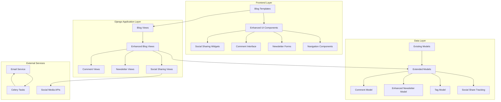
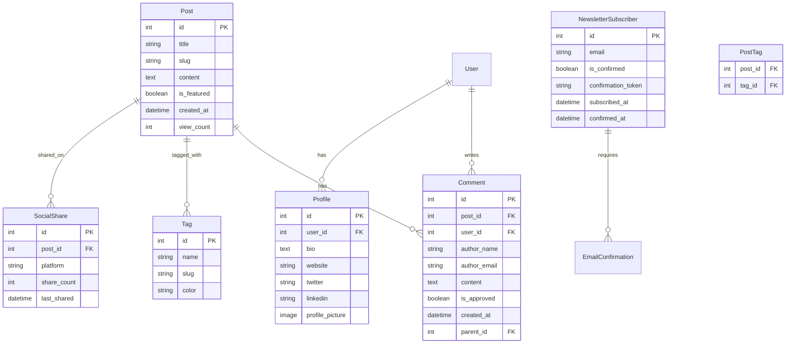

# Design Document

## Overview

This design document outlines the architecture and implementation approach for enhancing the existing Django blog system with comprehensive engagement features. The design builds upon the current blog infrastructure (Post, Category, NewsletterSubscriber models) and extends it with new models, views, and frontend components to support email subscriptions with confirmation, social sharing, commenting system, enhanced navigation, content discovery features, and multimedia integration.

The design follows Django best practices with a modular approach, ensuring scalability and maintainability while providing a seamless user experience across all engagement features.

## Architecture

### System Architecture Overview



### Database Schema Extensions

The design extends the existing database schema with new models while maintaining backward compatibility:



## Components and Interfaces

### 1. Enhanced Email Subscription System

**Components:**
- `EmailSubscriptionForm` - Enhanced form with confirmation workflow
- `EmailConfirmationView` - Handles email confirmation links
- `NewsletterService` - Service class for email operations
- `EmailTemplates` - HTML email templates for notifications

**Interface Design:**
```python
class EnhancedNewsletterSubscriber(models.Model):
    email = models.EmailField(unique=True)
    is_confirmed = models.BooleanField(default=False)
    confirmation_token = models.CharField(max_length=64, unique=True)
    subscribed_at = models.DateTimeField(auto_now_add=True)
    confirmed_at = models.DateTimeField(null=True, blank=True)
    unsubscribe_token = models.CharField(max_length=64, unique=True)
    
class NewsletterService:
    def send_confirmation_email(self, subscriber)
    def send_new_post_notification(self, post, subscribers)
    def confirm_subscription(self, token)
    def unsubscribe(self, token)
```

### 2. Social Sharing System

**Components:**
- `SocialShareWidget` - Frontend component with platform buttons
- `SocialShareTracker` - Backend tracking for analytics
- `OpenGraphMetaTags` - Enhanced meta tags for rich previews

**Interface Design:**
```python
class SocialShare(models.Model):
    post = models.ForeignKey(Post, on_delete=models.CASCADE)
    platform = models.CharField(max_length=20)
    share_count = models.PositiveIntegerField(default=0)
    last_shared = models.DateTimeField(auto_now=True)

class SocialShareService:
    def track_share(self, post, platform)
    def get_share_counts(self, post)
    def generate_share_urls(self, post)
```

### 3. Commenting System

**Components:**
- `CommentForm` - Form for submitting comments
- `CommentModerationInterface` - Admin interface for comment approval
- `CommentNotificationService` - Email notifications for new comments

**Interface Design:**
```python
class Comment(models.Model):
    post = models.ForeignKey(Post, on_delete=models.CASCADE, related_name='comments')
    parent = models.ForeignKey('self', on_delete=models.CASCADE, null=True, blank=True)
    author_name = models.CharField(max_length=100)
    author_email = models.EmailField()
    author_website = models.URLField(blank=True)
    content = models.TextField()
    is_approved = models.BooleanField(default=False)
    created_at = models.DateTimeField(auto_now_add=True)
    ip_address = models.GenericIPAddressField()

class CommentService:
    def create_comment(self, post, comment_data)
    def approve_comment(self, comment_id)
    def get_comment_tree(self, post)
    def send_notification(self, comment)
```

### 4. Enhanced Navigation System

**Components:**
- `TagCloud` - Visual tag representation
- `CategoryHierarchy` - Nested category navigation
- `SearchInterface` - Enhanced search with filters
- `BreadcrumbNavigation` - Contextual navigation

**Interface Design:**
```python
class Tag(models.Model):
    name = models.CharField(max_length=50, unique=True)
    slug = models.SlugField(unique=True)
    color = models.CharField(max_length=7, default='#007acc')
    description = models.TextField(blank=True)
    
class NavigationService:
    def get_tag_cloud(self)
    def get_category_hierarchy(self)
    def search_posts(self, query, filters)
    def get_breadcrumbs(self, current_page)
```

### 5. Content Discovery System

**Components:**
- `FeaturedPostsManager` - Manages featured content rotation
- `RelatedPostsEngine` - Algorithm for content recommendations
- `PopularPostsTracker` - Tracks and displays popular content

**Interface Design:**
```python
class ContentDiscoveryService:
    def get_featured_posts(self, limit=3)
    def get_related_posts(self, post, limit=3)
    def get_popular_posts(self, timeframe='week', limit=5)
    def update_view_count(self, post)
```

### 6. Author Profile System

**Components:**
- `AuthorProfileWidget` - Author information display
- `AuthorSocialLinks` - Social media integration
- `AuthorPostsArchive` - Author-specific post listings

**Interface Design:**
```python
class AuthorProfile(models.Model):
    user = models.OneToOneField(User, on_delete=models.CASCADE)
    bio = models.TextField(max_length=500)
    website = models.URLField(blank=True)
    twitter = models.CharField(max_length=50, blank=True)
    linkedin = models.URLField(blank=True)
    profile_picture = models.ImageField(upload_to='author_pics/')
    
class AuthorService:
    def get_author_profile(self, user)
    def get_author_posts(self, user)
    def get_author_social_links(self, user)
```

### 7. Multimedia Integration System

**Components:**
- `MediaUploadHandler` - Enhanced media management
- `ResponsiveImageProcessor` - Image optimization
- `VideoEmbedProcessor` - Video platform integration
- `ImageGalleryWidget` - Gallery and lightbox functionality

**Interface Design:**
```python
class MediaService:
    def process_image_upload(self, image, sizes=['thumbnail', 'medium', 'large'])
    def generate_responsive_images(self, image)
    def extract_video_embed(self, url)
    def create_image_gallery(self, images)
```

### 8. Table of Contents System

**Components:**
- `TOCGenerator` - Automatic heading extraction
- `TOCNavigationWidget` - Interactive navigation
- `ScrollSpyService` - Active section highlighting

**Interface Design:**
```python
class TableOfContentsService:
    def generate_toc(self, content)
    def extract_headings(self, html_content)
    def create_anchor_links(self, content)
    def should_show_toc(self, content, min_headings=3)
```

## Data Models

### Extended Models

```python
# Enhanced Newsletter Model
class NewsletterSubscriber(models.Model):
    email = models.EmailField(unique=True)
    is_confirmed = models.BooleanField(default=False)
    confirmation_token = models.CharField(max_length=64, unique=True, blank=True)
    unsubscribe_token = models.CharField(max_length=64, unique=True, blank=True)
    subscribed_at = models.DateTimeField(auto_now_add=True)
    confirmed_at = models.DateTimeField(null=True, blank=True)
    preferences = models.JSONField(default=dict)  # Email frequency, categories, etc.

# New Tag Model
class Tag(models.Model):
    name = models.CharField(max_length=50, unique=True)
    slug = models.SlugField(unique=True, blank=True)
    color = models.CharField(max_length=7, default='#007acc')
    description = models.TextField(blank=True)
    created_at = models.DateTimeField(auto_now_add=True)

# Enhanced Post Model (additions)
class Post(models.Model):
    # ... existing fields ...
    tags = models.ManyToManyField(Tag, related_name='posts', blank=True)
    allow_comments = models.BooleanField(default=True)
    social_image = models.ImageField(upload_to='social_images/', blank=True, null=True)
    table_of_contents = models.BooleanField(default=True)
    
# Comment Model
class Comment(models.Model):
    post = models.ForeignKey(Post, on_delete=models.CASCADE, related_name='comments')
    parent = models.ForeignKey('self', on_delete=models.CASCADE, null=True, blank=True, related_name='replies')
    author_name = models.CharField(max_length=100)
    author_email = models.EmailField()
    author_website = models.URLField(blank=True)
    content = models.TextField()
    is_approved = models.BooleanField(default=False)
    created_at = models.DateTimeField(auto_now_add=True)
    ip_address = models.GenericIPAddressField()
    user_agent = models.TextField(blank=True)

# Social Share Tracking
class SocialShare(models.Model):
    post = models.ForeignKey(Post, on_delete=models.CASCADE, related_name='social_shares')
    platform = models.CharField(max_length=20, choices=[
        ('facebook', 'Facebook'),
        ('twitter', 'Twitter'),
        ('linkedin', 'LinkedIn'),
        ('reddit', 'Reddit'),
    ])
    share_count = models.PositiveIntegerField(default=0)
    last_shared = models.DateTimeField(auto_now=True)

# Author Profile Enhancement
class AuthorProfile(models.Model):
    user = models.OneToOneField(User, on_delete=models.CASCADE, related_name='author_profile')
    bio = models.TextField(max_length=500, blank=True)
    website = models.URLField(blank=True)
    twitter = models.CharField(max_length=50, blank=True)
    linkedin = models.URLField(blank=True)
    github = models.CharField(max_length=50, blank=True)
    profile_picture = models.ImageField(upload_to='author_pics/', blank=True, null=True)
    is_guest_author = models.BooleanField(default=False)
```

## Error Handling

### Error Handling Strategy

**1. Email Subscription Errors:**
- Invalid email format validation
- Duplicate subscription handling
- Email delivery failure recovery
- Token expiration management

**2. Comment System Errors:**
- Spam detection and prevention
- Content validation and sanitization
- Moderation queue overflow handling
- Reply threading depth limits

**3. Social Sharing Errors:**
- Platform API failures
- Rate limiting handling
- Invalid URL generation recovery
- Share count synchronization issues

**4. Search and Navigation Errors:**
- Search query sanitization
- Empty result handling
- Category/tag not found scenarios
- Pagination edge cases

**Implementation:**
```python
class BlogEngagementException(Exception):
    """Base exception for blog engagement features"""
    pass

class EmailSubscriptionError(BlogEngagementException):
    """Email subscription related errors"""
    pass

class CommentModerationError(BlogEngagementException):
    """Comment system related errors"""
    pass

class SocialSharingError(BlogEngagementException):
    """Social sharing related errors"""
    pass

# Error handling middleware
class BlogEngagementErrorHandler:
    def handle_email_error(self, error, context)
    def handle_comment_error(self, error, context)
    def handle_social_error(self, error, context)
    def log_error(self, error, context)
```

## Testing Strategy

### Testing Approach

**1. Unit Testing:**
- Model validation and methods
- Service class functionality
- Form validation and processing
- Utility function testing

**2. Integration Testing:**
- Email subscription workflow
- Comment submission and approval
- Social sharing integration
- Search functionality

**3. Frontend Testing:**
- JavaScript functionality
- Responsive design
- User interaction flows
- Cross-browser compatibility

**4. Performance Testing:**
- Database query optimization
- Page load times
- Email sending performance
- Search response times

**Test Structure:**
```python
# tests/test_email_subscription.py
class EmailSubscriptionTestCase(TestCase):
    def test_subscription_creation(self)
    def test_email_confirmation(self)
    def test_unsubscribe_flow(self)
    def test_duplicate_subscription(self)

# tests/test_commenting_system.py
class CommentSystemTestCase(TestCase):
    def test_comment_creation(self)
    def test_comment_moderation(self)
    def test_reply_threading(self)
    def test_spam_prevention(self)

# tests/test_social_sharing.py
class SocialSharingTestCase(TestCase):
    def test_share_url_generation(self)
    def test_share_tracking(self)
    def test_meta_tag_generation(self)

# tests/test_content_discovery.py
class ContentDiscoveryTestCase(TestCase):
    def test_related_posts_algorithm(self)
    def test_featured_posts_selection(self)
    def test_search_functionality(self)
    def test_tag_filtering(self)
```

### Performance Considerations

**1. Database Optimization:**
- Proper indexing for search queries
- Efficient related post algorithms
- Comment threading optimization
- View count tracking optimization

**2. Caching Strategy:**
- Featured posts caching
- Popular posts caching
- Tag cloud caching
- Search results caching

**3. Email Performance:**
- Asynchronous email sending
- Batch newsletter processing
- Email queue management
- Delivery failure handling

**4. Frontend Optimization:**
- Lazy loading for comments
- Progressive enhancement
- Optimized image delivery
- Minified assets

### Security Considerations

**1. Input Validation:**
- Comment content sanitization
- Email validation and verification
- Search query sanitization
- File upload validation

**2. Spam Prevention:**
- Rate limiting for comments
- CAPTCHA integration
- IP-based blocking
- Content filtering

**3. Privacy Protection:**
- Email address encryption
- GDPR compliance features
- User data anonymization
- Secure token generation

**4. Access Control:**
- Comment moderation permissions
- Admin-only features protection
- Guest author limitations
- API endpoint security