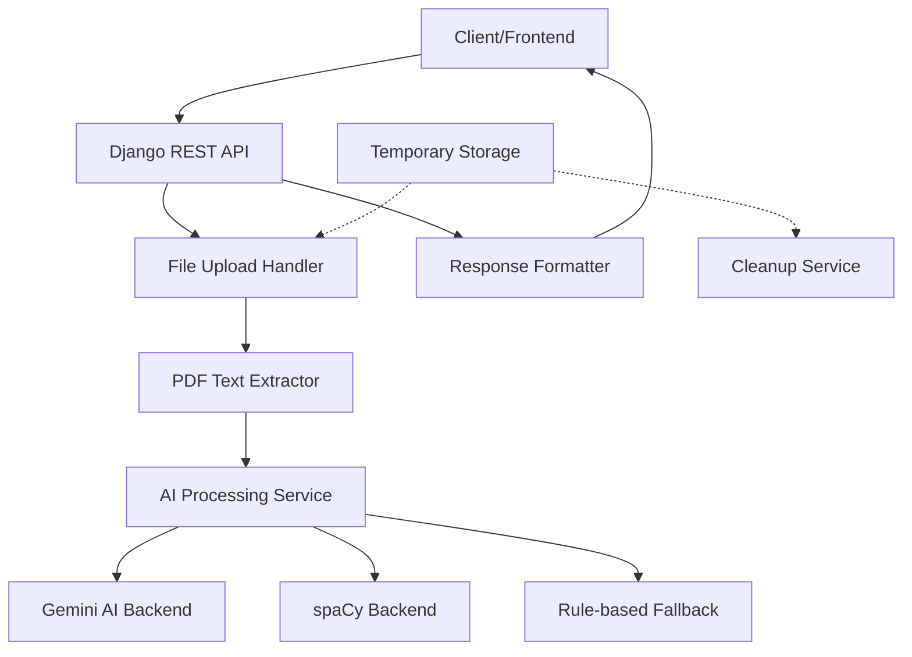

# Design Document

## Overview

The Resume Parser is a Django application that provides a REST API for uploading PDF resumes and extracting structured information. The system uses a modular architecture with pluggable AI backends (Gemini AI or spaCy) for natural language processing. The design prioritizes privacy by ensuring no resume data is persisted after processing.

## Architecture

### High-Level Architecture



### Component Interaction Flow

1. **Upload Phase**: Client uploads PDF → Django validates file → Temporary storage
2. **Extraction Phase**: PDF text extraction → AI processing → Structured data extraction
3. **Response Phase**: Format response → Send to client → Cleanup temporary files

## Components and Interfaces

### 1. Django App Structure

```
roadmap/
├── __init__.py
├── apps.py
├── models.py (minimal - no data persistence)
├── views.py (API endpoints)
├── serializers.py (request/response validation)
├── urls.py
├── services/
│   ├── __init__.py
│   ├── pdf_extractor.py
│   ├── ai_processor.py
│   ├── gemini_backend.py
│   ├── spacy_backend.py
│   └── cleanup_service.py
├── utils/
│   ├── __init__.py
│   ├── validators.py
│   └── exceptions.py
└── tests/
    ├── __init__.py
    ├── test_views.py
    ├── test_services.py
    └── test_utils.py
```

### 2. Core Services

#### PDF Text Extractor Service
- **Purpose**: Extract text content from PDF files
- **Dependencies**: PyPDF2 or pdfplumber
- **Interface**:
  ```python
  class PDFExtractor:
      def extract_text(self, pdf_file) -> str
      def validate_pdf(self, pdf_file) -> bool
  ```

#### AI Processor Service
- **Purpose**: Coordinate between different AI backends
- **Interface**:
  ```python
  class AIProcessor:
      def process_resume_text(self, text: str, backend: str) -> dict
      def get_available_backends(self) -> list
  ```

#### Backend Services
- **Gemini Backend**: Integrates with Google's Gemini AI API
- **spaCy Backend**: Uses local NLP models for entity recognition
- **Rule-based Fallback**: Regex and keyword-based extraction

#### Cleanup Service
- **Purpose**: Ensure temporary files are removed
- **Interface**:
  ```python
  class CleanupService:
      def cleanup_temp_file(self, file_path: str) -> None
      def cleanup_on_error(self, file_path: str) -> None
  ```

### 3. API Endpoints

#### POST /api/roadmap/parse-resume/
- **Purpose**: Upload and process resume
- **Request**: Multipart form data with PDF file
- **Response**: JSON with extracted information
- **Status Codes**: 200 (success), 400 (invalid file), 413 (file too large), 422 (processing error)

#### GET /api/roadmap/health/
- **Purpose**: Health check for AI backends
- **Response**: Status of available processing backends

## Data Models

### Request/Response Models (Serializers Only)

#### ResumeUploadSerializer
```python
class ResumeUploadSerializer(serializers.Serializer):
    resume_file = serializers.FileField(
        validators=[validate_pdf_file, validate_file_size]
    )
    processing_backend = serializers.ChoiceField(
        choices=['gemini', 'spacy', 'auto'],
        default='auto'
    )
```

#### ResumeDataSerializer
```python
class ResumeDataSerializer(serializers.Serializer):
    name = serializers.CharField(allow_null=True)
    email = serializers.EmailField(allow_null=True)
    phone = serializers.CharField(allow_null=True)
    skills = serializers.ListField(child=serializers.CharField())
    experience = serializers.ListField(child=ExperienceSerializer())
    education = serializers.ListField(child=EducationSerializer())
    processing_backend_used = serializers.CharField()
    confidence_score = serializers.FloatField()
```

### Configuration Model
```python
class ResumeParserConfig(models.Model):
    """Single configuration instance for the resume parser"""
    gemini_api_key = models.CharField(max_length=255, blank=True)
    max_file_size_mb = models.IntegerField(default=10)
    default_backend = models.CharField(max_length=20, default='auto')
    spacy_model = models.CharField(max_length=50, default='en_core_web_sm')
    
    class Meta:
        verbose_name = "Resume Parser Configuration"
```

## Error Handling

### Error Categories

1. **File Validation Errors**
   - Invalid file format
   - File size exceeded
   - Corrupted PDF

2. **Processing Errors**
   - PDF text extraction failure
   - AI backend unavailable
   - Parsing timeout

3. **System Errors**
   - Temporary storage issues
   - Configuration errors
   - Network connectivity issues

### Error Response Format
```json
{
    "error": {
        "code": "INVALID_FILE_FORMAT",
        "message": "Only PDF files are supported",
        "details": {
            "file_type": "application/msword",
            "supported_types": ["application/pdf"]
        }
    }
}
```

### Fallback Strategy
1. **Primary**: Gemini AI processing
2. **Secondary**: spaCy local processing
3. **Tertiary**: Rule-based extraction
4. **Final**: Return partial results with error indicators

## Testing Strategy

### Unit Tests
- PDF text extraction functionality
- Individual AI backend services
- File validation logic
- Cleanup service operations

### Integration Tests
- End-to-end API workflow
- AI backend switching
- Error handling scenarios
- File cleanup verification

### Performance Tests
- Large PDF processing
- Concurrent upload handling
- Memory usage monitoring
- Response time benchmarks

### Security Tests
- File upload validation
- Temporary file isolation
- Data sanitization
- API rate limiting

## Security Considerations

### File Upload Security
- File type validation using magic numbers
- File size limits (configurable, default 10MB)
- Temporary file isolation
- Virus scanning integration (optional)

### Data Privacy
- No persistent storage of resume content
- Secure temporary file handling
- Memory cleanup after processing
- Audit logging without sensitive data

### API Security
- Rate limiting on upload endpoints
- Input validation and sanitization
- CORS configuration
- Authentication integration (if required)

## Performance Considerations

### Optimization Strategies
- Asynchronous processing for large files
- Caching of AI model responses (without storing resume data)
- Connection pooling for AI API calls
- Efficient PDF parsing libraries

### Scalability
- Horizontal scaling support
- Load balancing considerations
- Resource monitoring
- Queue-based processing for high volume

## Dependencies

### Required Python Packages
- `PyPDF2` or `pdfplumber` - PDF text extraction
- `spacy` - Local NLP processing
- `google-generativeai` - Gemini AI integration
- `djangorestframework` - API framework
- `python-magic` - File type detection

### System Requirements
- Python 3.8+
- Django 4.0+
- Sufficient memory for PDF processing
- Network access for Gemini AI (if used)

## Configuration

### Environment Variables
```bash
GEMINI_API_KEY=your_gemini_api_key
RESUME_PARSER_MAX_FILE_SIZE=10  # MB
RESUME_PARSER_DEFAULT_BACKEND=auto
SPACY_MODEL=en_core_web_sm
```

### Django Settings Integration
```python
RESUME_PARSER_SETTINGS = {
    'MAX_FILE_SIZE_MB': 10,
    'ALLOWED_FILE_TYPES': ['application/pdf'],
    'DEFAULT_BACKEND': 'auto',
    'TEMP_FILE_CLEANUP_TIMEOUT': 300,  # seconds
}
```