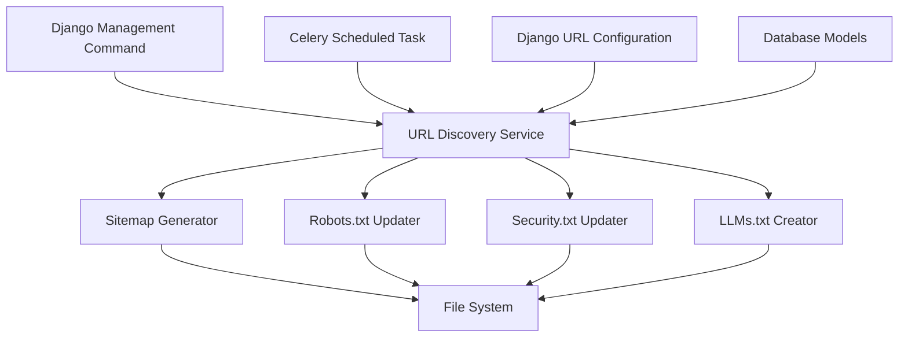

# Design Document: Site Files Updater

## Overview

The Site Files Updater is a system that automatically updates important site metadata files (Sitemap.xml, robots.txt, security.txt) and creates a new LLMs.txt file to provide guidance for large language models. The system will run as a scheduled task using Django's Celery Beat and can also be triggered manually via a management command.

This design document outlines the architecture, components, data models, and implementation strategy for the Site Files Updater feature.

## Architecture

The Site Files Updater will be implemented as a Django app with the following components:

1. **URL Discovery Service**: Responsible for discovering all available URLs in the Django project
2. **File Generator Services**: Separate services for generating each file type (Sitemap.xml, robots.txt, security.txt, LLMs.txt)
3. **Management Command**: A Django management command for manual execution
4. **Celery Task**: A scheduled task for automatic execution
5. **Configuration System**: Settings for controlling the behavior of the updater

The system will follow a service-oriented architecture within the Django framework, with clear separation of concerns between URL discovery, file generation, and task scheduling.

### High-Level Architecture Diagram



## Components and Interfaces

### 1. URL Discovery Service

The URL Discovery Service will be responsible for collecting all available URLs from the Django project. It will:

- Extract URL patterns from Django's URL configuration
- Query database models for dynamic content URLs (e.g., blog posts)
- Filter out non-public URLs (e.g., admin URLs)
- Categorize URLs by type and importance

**Interface:**
```python
class URLDiscoveryService:
    def get_all_public_urls(self) -> List[URLInfo]:
        """
        Discovers all public-facing URLs in the Django project.
        Returns a list of URLInfo objects.
        """
        pass
    
    def get_dynamic_content_urls(self) -> List[URLInfo]:
        """
        Queries the database for dynamic content URLs.
        Returns a list of URLInfo objects.
        """
        pass
```

### 2. File Generator Services

#### 2.1 Sitemap Generator

The Sitemap Generator will create an XML sitemap based on the discovered URLs.

**Interface:**
```python
class SitemapGenerator:
    def __init__(self, url_discovery_service: URLDiscoveryService):
        self.url_discovery_service = url_discovery_service
    
    def generate_sitemap(self) -> str:
        """
        Generates an XML sitemap based on discovered URLs.
        Returns the XML content as a string.
        """
        pass
    
    def write_sitemap_file(self, path: str) -> bool:
        """
        Writes the generated sitemap to the specified file path.
        Returns True if successful, False otherwise.
        """
        pass
```

#### 2.2 Robots.txt Updater

The Robots.txt Updater will update the robots.txt file with the current sitemap URL while preserving existing rules.

**Interface:**
```python
class RobotsTxtUpdater:
    def __init__(self, site_url: str):
        self.site_url = site_url
    
    def update_robots_txt(self, path: str, sitemap_path: str) -> bool:
        """
        Updates the robots.txt file at the specified path.
        Returns True if successful, False otherwise.
        """
        pass
```

#### 2.3 Security.txt Updater

The Security.txt Updater will update the security.txt file with the current canonical URL while preserving existing content.

**Interface:**
```python
class SecurityTxtUpdater:
    def __init__(self, site_url: str):
        self.site_url = site_url
    
    def update_security_txt(self, path: str) -> bool:
        """
        Updates the security.txt file at the specified path.
        Returns True if successful, False otherwise.
        """
        pass
```

#### 2.4 LLMs.txt Creator

The LLMs.txt Creator will create or update the LLMs.txt file with guidance for large language models.

**Interface:**
```python
class LLMsTxtCreator:
    def __init__(self, url_discovery_service: URLDiscoveryService, site_info: Dict):
        self.url_discovery_service = url_discovery_service
        self.site_info = site_info
    
    def create_llms_txt(self, path: str) -> bool:
        """
        Creates or updates the LLMs.txt file at the specified path.
        Returns True if successful, False otherwise.
        """
        pass
```

### 3. Management Command

A Django management command will be created to allow manual execution of the file updates.

**Interface:**
```python
class Command(BaseCommand):
    help = 'Updates site metadata files (Sitemap.xml, robots.txt, security.txt, LLMs.txt)'
    
    def add_arguments(self, parser):
        parser.add_argument('--sitemap', action='store_true', help='Update only the sitemap')
        parser.add_argument('--robots', action='store_true', help='Update only the robots.txt')
        parser.add_argument('--security', action='store_true', help='Update only the security.txt')
        parser.add_argument('--llms', action='store_true', help='Update only the LLMs.txt')
    
    def handle(self, *args, **options):
        # Implementation
        pass
```

### 4. Celery Task

A Celery task will be created to run the file updates on a schedule.

**Interface:**
```python
@shared_task
def update_site_files():
    """
    Updates all site metadata files.
    """
    # Implementation
    pass
```

## Data Models

### URLInfo Model

This is a data transfer object (not a database model) used to represent URL information:

```python
@dataclass
class URLInfo:
    url: str  # The relative or absolute URL
    lastmod: datetime = None  # Last modification date
    changefreq: str = 'monthly'  # Change frequency (daily, weekly, monthly, etc.)
    priority: float = 0.5  # Priority (0.0 to 1.0)
    title: str = None  # Page title if available
    type: str = 'page'  # Type of content (page, blog, api, etc.)
```

### Configuration Model

A simple model to store configuration settings for the Site Files Updater:

```python
class SiteFilesConfig(models.Model):
    """Configuration settings for the Site Files Updater."""
    
    # Site information
    site_name = models.CharField(max_length=255, default='My Site')
    site_url = models.URLField(default='https://example.com')
    
    # File paths
    sitemap_path = models.CharField(max_length=255, default='static/Sitemap.xml')
    robots_path = models.CharField(max_length=255, default='static/robots.txt')
    security_path = models.CharField(max_length=255, default='static/security.txt')
    llms_path = models.CharField(max_length=255, default='static/LLMs.txt')
    
    # Schedule settings
    update_frequency = models.CharField(
        max_length=20,
        choices=[
            ('daily', 'Daily'),
            ('weekly', 'Weekly'),
            ('monthly', 'Monthly'),
        ],
        default='daily'
    )
    
    # Feature flags
    update_sitemap = models.BooleanField(default=True)
    update_robots = models.BooleanField(default=True)
    update_security = models.BooleanField(default=True)
    update_llms = models.BooleanField(default=True)
    
    # Timestamps
    last_update = models.DateTimeField(null=True, blank=True)
    
    class Meta:
        verbose_name = 'Site Files Configuration'
        verbose_name_plural = 'Site Files Configuration'
```

## Error Handling

The Site Files Updater will implement a robust error handling strategy:

1. **File Operation Errors**: All file operations will be wrapped in try-except blocks to catch IOError, PermissionError, etc.
2. **URL Discovery Errors**: Errors in URL discovery will be caught and logged, with the system falling back to a minimal set of known URLs.
3. **Database Query Errors**: Database query errors will be caught and logged, with the system proceeding with available data.
4. **XML Generation Errors**: XML parsing or generation errors will be caught and logged, with the system maintaining the previous file.

All errors will be logged using Django's logging system, and critical errors will trigger notifications to administrators.

## Testing Strategy

The testing strategy for the Site Files Updater will include:

### Unit Tests

1. **URL Discovery Tests**: Test the URL discovery service with mock URL patterns and database models.
2. **File Generator Tests**: Test each file generator service with mock data.
3. **Management Command Tests**: Test the management command with various arguments.
4. **Celery Task Tests**: Test the Celery task execution.

### Integration Tests

1. **End-to-End Tests**: Test the complete flow from URL discovery to file generation.
2. **File Format Tests**: Validate the generated files against their respective specifications.
3. **Schedule Tests**: Test the scheduled execution of the Celery task.

### Manual Tests

1. **File Content Verification**: Manually verify the content of generated files.
2. **Search Engine Validation**: Use search engine tools to validate the sitemap and robots.txt.
3. **LLMs Interaction**: Test interaction with LLMs using the generated LLMs.txt.

## Implementation Considerations

### File Paths and Permissions

The system will need appropriate file permissions to write to the static files directory. The implementation will:

1. Use Django's `settings.STATIC_ROOT` and `settings.STATICFILES_DIRS` to determine the correct file paths.
2. Check file permissions before attempting to write files.
3. Create backup copies of existing files before overwriting them.

### URL Discovery Optimization

For large sites with many URLs, the URL discovery process could be resource-intensive. The implementation will:

1. Use caching to store discovered URLs.
2. Implement pagination for database queries.
3. Use asynchronous processing for non-blocking URL discovery.

### Scheduled Task Configuration

The Celery task will be configured using Django Celery Beat's dynamic scheduler:

1. Create a periodic task in the database.
2. Allow configuration of the schedule through the admin interface.
3. Implement retry logic for failed tasks.

## Deployment Considerations

When deploying the Site Files Updater, the following considerations should be addressed:

1. **Static Files Collection**: Ensure that the generated files are included in Django's `collectstatic` process.
2. **Celery Worker Configuration**: Configure Celery workers to handle the scheduled tasks.
3. **File Permissions**: Set appropriate file permissions for the static files directory.
4. **Monitoring**: Set up monitoring for the scheduled tasks and file generation process.

## Future Enhancements

Potential future enhancements for the Site Files Updater include:

1. **Image Sitemap**: Add support for generating an image sitemap.
2. **Video Sitemap**: Add support for generating a video sitemap.
3. **News Sitemap**: Add support for generating a news sitemap.
4. **Sitemap Index**: Support for generating a sitemap index for large sites.
5. **Custom File Templates**: Allow customization of file templates through the admin interface.
6. **Performance Metrics**: Track and report on the performance of the file generation process.
7. **Integration with CDN**: Automatically invalidate CDN caches when files are updated.