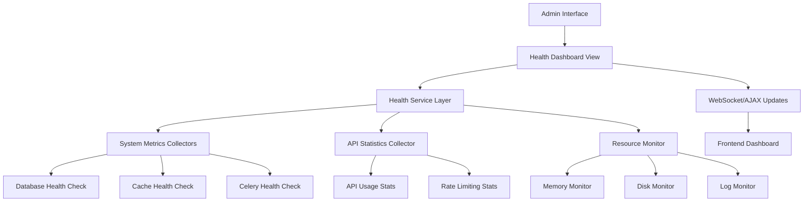

# System Health Dashboard Design Document

## Overview

The System Health Dashboard is a Django-based monitoring interface that provides real-time system metrics and health status information. It integrates with the existing Django admin interface and leverages the current technology stack including MySQL, Redis, Celery, and the API authentication system.

## Architecture

### High-Level Architecture



### Component Integration

The dashboard integrates with existing system components:
- **Django Admin**: Uses the existing Unfold admin theme and navigation
- **API System**: Leverages existing API models for usage statistics
- **Cache System**: Monitors Redis cache health and performance
- **Database**: Checks MySQL connection and query performance
- **Celery**: Monitors worker status and task queue health

## Components and Interfaces

### 1. Health Dashboard View (`core/views.py`)

**Purpose**: Main view controller for the health dashboard

**Key Methods**:
- `health_dashboard_view()`: Renders the main dashboard template
- `health_api_view()`: JSON API endpoint for AJAX updates
- `get_system_health()`: Aggregates all health metrics

**Permissions**: Requires `is_staff` and `is_superuser` permissions

### 2. Health Service (`core/services/health_service.py`)

**Purpose**: Central service for collecting and aggregating health metrics

**Key Methods**:
- `get_database_health()`: Database connectivity and performance
- `get_cache_health()`: Redis cache status and metrics
- `get_celery_health()`: Worker status and queue metrics
- `get_api_health()`: API usage and error statistics
- `get_system_resources()`: Memory, disk, and system metrics

### 3. System Metrics Collectors

#### Database Health Collector
- Connection pool status
- Query execution time
- Active connections count
- Database size and growth

#### Cache Health Collector
- Redis connection status
- Memory usage
- Hit/miss ratios
- Key count and expiration

#### Celery Health Collector
- Active workers count
- Queue lengths
- Failed task count
- Worker response times

#### API Statistics Collector
- Request count (24h, 1h)
- Error rates by endpoint
- Active client count
- Rate limiting statistics

#### Resource Monitor
- Memory usage (total, available, percentage)
- Disk space (total, used, available)
- Recent error logs
- System load average

### 4. Frontend Dashboard (`templates/core/health_dashboard.html`)

**Purpose**: Interactive dashboard interface with real-time updates

**Features**:
- Responsive grid layout
- Status indicators (green/yellow/red)
- Real-time metric updates
- Chart visualizations for trends
- Alert notifications for critical issues

## Data Models

### Health Metrics Model (`core/models.py`)

```python
class HealthMetric(models.Model):
    metric_name = models.CharField(max_length=100)
    metric_value = models.JSONField()
    status = models.CharField(max_length=20)  # 'healthy', 'warning', 'critical'
    timestamp = models.DateTimeField(auto_now_add=True)
    
    class Meta:
        ordering = ['-timestamp']
```

### System Alert Model

```python
class SystemAlert(models.Model):
    alert_type = models.CharField(max_length=50)
    message = models.TextField()
    severity = models.CharField(max_length=20)  # 'info', 'warning', 'critical'
    resolved = models.BooleanField(default=False)
    created_at = models.DateTimeField(auto_now_add=True)
    resolved_at = models.DateTimeField(null=True, blank=True)
```

## Error Handling

### Health Check Failures
- Graceful degradation when services are unavailable
- Timeout handling for slow health checks
- Fallback metrics when primary sources fail
- Error logging for debugging

### Dashboard Resilience
- Retry mechanisms for failed AJAX requests
- Offline mode indicators
- Cached data display when real-time updates fail
- User-friendly error messages

## Testing Strategy

### Unit Tests
- Health service method testing
- Metric collector validation
- Error handling scenarios
- Permission and authentication tests

### Integration Tests
- End-to-end dashboard functionality
- Real-time update mechanisms
- Database and cache integration
- API endpoint response validation

### Performance Tests
- Dashboard load time optimization
- Metric collection performance
- Memory usage during monitoring
- Concurrent user access testing

## Security Considerations

### Access Control
- Admin-only access enforcement
- CSRF protection for AJAX endpoints
- Rate limiting for health API calls
- Secure handling of sensitive metrics

### Data Privacy
- No exposure of sensitive configuration
- Sanitized error messages
- Secure logging practices
- Encrypted data transmission

## Implementation Phases

### Phase 1: Core Infrastructure
- Basic health service implementation
- Database and cache health checks
- Simple dashboard view
- Admin navigation integration

### Phase 2: Metrics Collection
- API statistics integration
- System resource monitoring
- Celery health monitoring
- Alert system implementation

### Phase 3: Real-time Features
- AJAX-based updates
- WebSocket integration (optional)
- Chart visualizations
- Mobile-responsive design

### Phase 4: Advanced Features
- Historical trend analysis
- Automated alerting
- Export capabilities
- Custom metric definitions