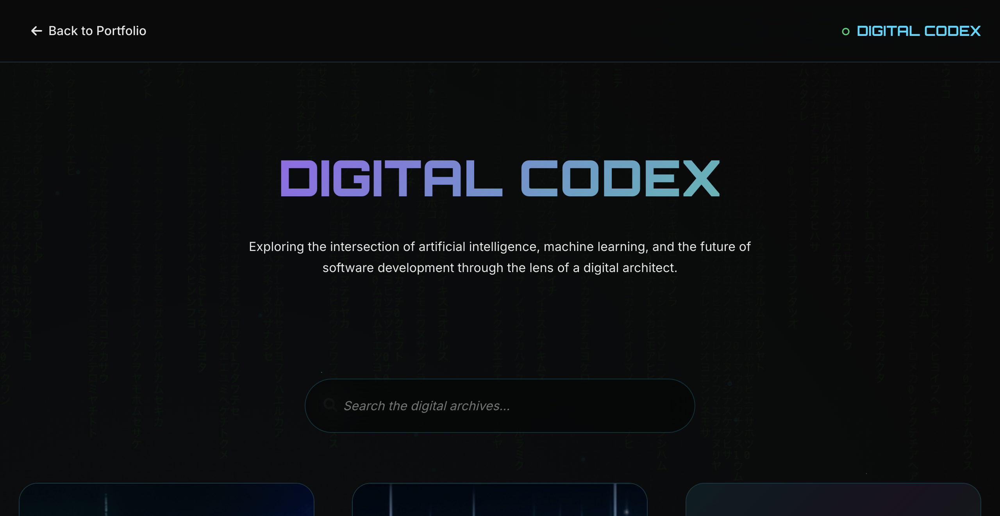
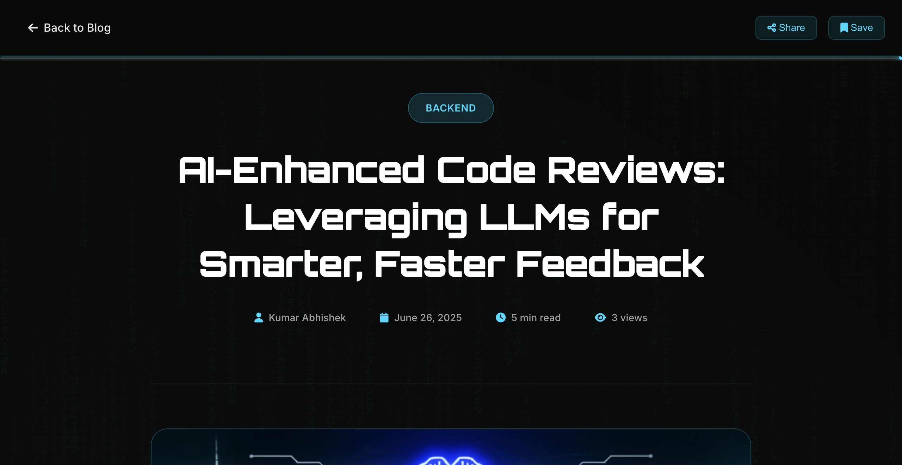

# Kabhishek18 - Personal Portfolio & Blog

This is a personal portfolio and blog website built with Django. It features a dynamic blog, a custom page management system, and a modern admin interface.


## Features

*   **Dynamic Blog:** Create, edit, and manage blog posts with categories and tags.
*   **Page Management:** A flexible system for creating and managing custom pages with different templates.
*   **Modern Admin Interface:** A customized admin panel built with `django-unfold` for a user-friendly experience.
*   **Asynchronous Tasks:** Uses Celery with Redis for background tasks like sending newsletters.
*   **Environment-based Settings:** Securely manages configuration using `.env` files.

## Screenshots

| Admin Dashboard | Blog Page |
|---|---|
|  |  |


|  Blog Detail Page |
|---|
|  |

## Getting Started

These instructions will get you a copy of the project up and running on your local machine for development and testing purposes.

### Prerequisites

*   Python 3.10+
*   MySQL
*   Redis

### Installation

1.  **Clone the repository:**
    ```bash
    git clone https://github.com/your-username/kabhishek18-2025.git
    cd kabhishek18-2025
    ```

2.  **Create a virtual environment and activate it:**
    ```bash
    python -m venv venv
    source venv/bin/activate  # On Windows, use `venv\Scripts\activate`
    ```

3.  **Install the dependencies:**
    ```bash
    pip install -r requirements.txt
    ```

4.  **Create a `.env` file** in the project root and add the following environment variables:
    ```env
    SECRET_KEY=your-secret-key
    DEBUG=True
    ALLOWED_HOSTS=127.0.0.1,localhost
    DB_NAME=your-db-name
    DB_USER=your-db-user
    DB_PASSWORD=your-db-password
    ```

5.  **Run the database migrations:**
    ```bash
    python manage.py migrate
    ```

6.  **Create a superuser:**
    ```bash
    python manage.py createsuperuser
    ```

## Management Commands

This project includes custom management commands to automate common tasks.

### `projectsetup`

Automates project setup and management.

*   **Initialize the project:**
    ```bash
    python manage.py projectsetup init
    ```
    This command creates the database, runs migrations, creates a superuser, and syncs templates.

*   **Reset the database:**
    ```bash
    python manage.py projectsetup resetdb
    ```
    This command drops and recreates the database, then runs migrations and syncs templates.

*   **Reset a specific app:**
    ```bash
    python manage.py projectsetup resetapp <app_label>
    ```
    This command reverts all migrations for a specific app and then re-applies them.

*   **Sync templates:**
    ```bash
    python manage.py projectsetup synctemplates
    ```
    This command synchronizes template files from the `includes/` directory to the database.

### `aicontent`

Uses Gemini AI to generate blog content and featured images.

*   **Create a blog post:**
    ```bash
    python manage.py aicontent create_post
    ```
    This command generates a new blog post with a title, excerpt, content, and a featured image.

*   **Create a blog post with a specific topic:**
    ```bash
    python manage.py aicontent create_post --topic "Your Topic"
    ```

*   **Create a blog post without a featured image:**
    ```bash
    python manage.py aicontent create_post --no-image
    ```

*   **Regenerate the featured image for an existing post:**
    ```bash
    python manage.py aicontent update_image --slug <post-slug>
    ```

### `screenshot`

Takes screenshots of key pages of the website using Selenium.

*   **Take screenshots:**
    ```bash
    python manage.py screenshot
    ```
    This command will take screenshots of the homepage, blog list, admin index, and the latest blog post, saving them to the `screenshots` directory.

## Running the application

1.  **Start the development server:**
    ```bash
    python manage.py runserver
    ```

2.  **Start the Celery worker:**
    ```bash
    celery -A kabhishek18 worker -l info
    ```

3.  **Start the Celery beat scheduler:**
    ```bash
    celery -A kabhishek18 beat -l info
    ```

The application will be available at `http://127.0.0.1:8000`.

## Built With

*   [Django](https://www.djangoproject.com/) - The web framework for perfectionists with deadlines.
*   [django-unfold](https://github.com/unfoldadmin/django-unfold) - A modern, responsive theme for the Django admin.
*   [Celery](https://docs.celeryq.dev/en/stable/) - Distributed Task Queue.
*   [MySQL](https://www.mysql.com/) - The world's most popular open source database.
*   [Redis](https://redis.io/) - An in-memory data structure store, used as a message broker.

## License

This project is licensed under the MIT License - see the [LICENSE.md](LICENSE.md) file for details.

## Contact

Kumar Abhishek - [@kabhishek18](https://kabhishek18.com) - developer@kabhishek18.com

Project Link: [https://github.com/kabhishek18/kabhishek18-2025](https://github.com/kabhishek18/kabhishek18-2025)
